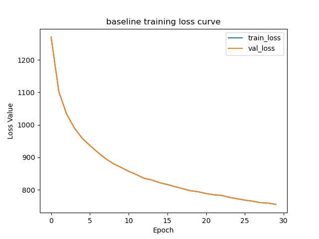
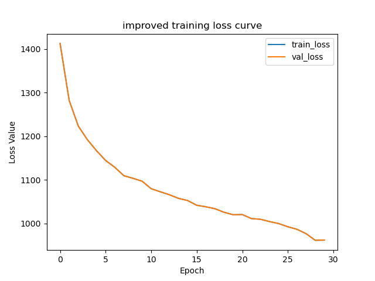

# CIFAR-10 Image Classification

Image classification on CIFAR-10 using two convolutional neural network architectures:

- Baseline CNN
- Improved CNN (Batch Normalization, Dropout, Label Smoothing)

## How to Run

Train both models:
`python train.py`

Train only baseline:
`python train.py baseline`

Train only improved:
`python train.py improved`

Evaluate models:
`python evaluate.py`

Training and evaluation automatically generate plots and readable metric files.

## Training Loss Curves

### Baseline Model

### Improved Model

## Train / Validation Split Method

The original CIFAR-10 training dataset contains 50,000 images.  
A random 90:10 split is applied using PyTorch's `random_split()`:

- Training Set: 45,000 images
- Validation Set: 5,000 images

A random split was chosen to keep the pipeline simple and reproducible while still maintaining balanced class distribution, since CIFAR-10 is already evenly distributed across all classes.  
A fixed seed is used so that the same split can be recreated across runs.

## Metrics Reported

- Accuracy
- Precision
- Recall
- F1-score
- Macro Average
- Weighted Average
- Confusion Matrix

Metric files are saved in:

`outputs/metrics/baseline_metrics.txt`  
`outputs/metrics/improved_metrics.txt`

Plots are saved in:

`outputs/plots/`

## Results

### Overall Performance

| Model        | Accuracy |
|--------------|----------|
| Baseline CNN | 0.7543   |
| Improved CNN | 0.8004   |

### Macro Average Metrics

| Model        | Precision | Recall | F1-score |
|--------------|-----------|--------|----------|
| Baseline CNN | 0.76      | 0.75   | 0.75     |
| Improved CNN | 0.80      | 0.80   | 0.80     |

### Weighted Average Metrics

| Model        | Precision | Recall | F1-score |
|--------------|-----------|--------|----------|
| Baseline CNN | 0.76      | 0.75   | 0.75     |
| Improved CNN | 0.80      | 0.80   | 0.80     |

### Selected Class-wise F1 Scores

| Class | Baseline CNN | Improved CNN |
|------|--------------|--------------|
| 1    | 0.87         | 0.90         |
| 6    | 0.80         | 0.83         |
| 8    | 0.83         | 0.90         |
| 9    | 0.83         | 0.89         |

## Best Result

Improved CNN  
Test Accuracy: `80.04%`

## Additions

- Label Smoothing during training
- Batch Normalization and Dropout in improved model
- Automatic graph generation with labeled axes
- Human-readable metric output files
- Ability to run both or individual models
- CPU-only execution
- Grad-CAM visualization module included

